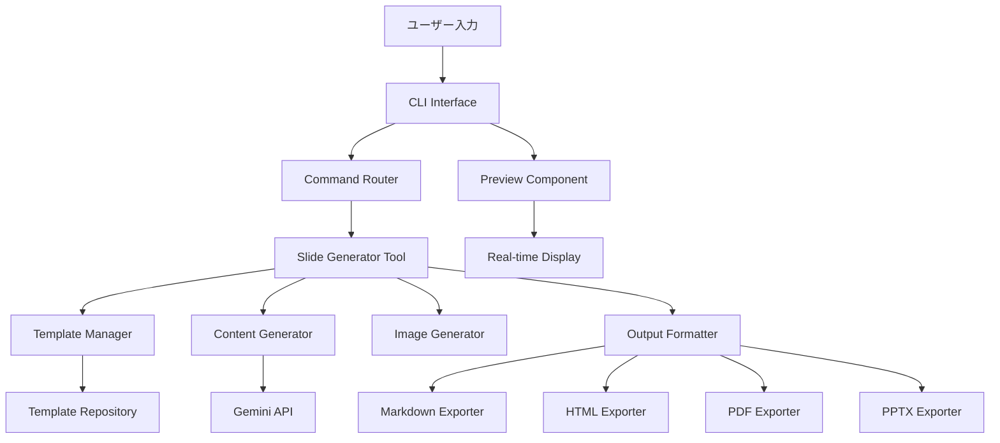

# 🎯 スライド生成特化CLIエージェント実装手順書

## 📖 プロジェクト概要

### 目的
Gemini CLIをベースとした、プレゼンテーションスライドを自動生成する専門的なCLIエージェントの構築。ユーザーはテーマを入力するだけで、構造化された美しいスライドを瞬時に生成できるようになります。

### 価値提案
- **10倍の効率化**: 手動作成の10倍の速度でプロフェッショナルなスライドを生成
- **AI駆動**: 最新のGemini APIを活用した高品質なコンテンツ生成
- **多様な出力**: Markdown、HTML、PDF、PPTXなど複数フォーマット対応
- **カスタマイズ可能**: 豊富なテンプレートとスタイルオプション

### Gemini CLIからの進化点
1. **専門特化**: スライド生成に特化した機能とUI
2. **リアルタイムプレビュー**: 生成中のスライドの即座確認
3. **テンプレートシステム**: プロフェッショナル、アカデミック、クリエイティブなどのスタイル
4. **画像・図表統合**: AI生成画像との自動統合
5. **協調編集**: チームでの同時編集機能

---

## 🏗️ アーキテクチャ設計

### システム構成図



### データフロー
1. **入力処理**: ユーザーがトピックと設定を入力
2. **構造設計**: AIがプレゼンテーション構造を設計
3. **コンテンツ生成**: 各スライドの内容をGemini APIで生成
4. **テンプレート適用**: 選択されたスタイルテンプレートを適用
5. **画像統合**: 必要に応じてAI画像を生成・統合
6. **フォーマット変換**: 指定された出力形式に変換
7. **プレビュー表示**: リアルタイムでプレビューを表示

---

## 📅 段階的実装計画

### 🌱 初期段階（1-2週間）

#### Week 1: 核となるツールの実装

##### 1. スライド生成ツール（slide-generator.ts）
**ファイル**: `packages/core/src/tools/slide-generator.ts`

**実装内容**:
```typescript
export interface SlideGeneratorToolParams {
  topic: string;                    // メイントピック
  slides_count?: number;            // スライド数 (デフォルト: 10)
  style?: 'professional' | 'creative' | 'academic' | 'casual';
  audience?: string;                // 対象者
  language?: string;                // 言語 (デフォルト: Japanese)
  include_images?: boolean;         // 画像を含むか
  include_code?: boolean;           // コード例を含むか
  include_notes?: boolean;          // スピーカーノート
  output_format?: 'markdown' | 'html' | 'json';
}
```

**主要機能**:
- プレゼンテーション構造の自動設計
- スライド内容の生成
- 複数出力形式の対応
- プログレス表示機能

##### 2. Markdownスライドツール（markdown-slide.ts）
**ファイル**: `packages/core/src/tools/markdown-slide.ts`

**実装内容**:
- Marp形式対応
- reveal.js形式対応
- Slidev形式対応
- カスタムCSSテンプレート

##### 3. スライドコマンド（slideCommand.ts）
**ファイル**: `packages/cli/src/ui/commands/slideCommand.ts`

**コマンド構造**:
```bash
/slide new <topic>           # 新規スライド作成
/slide preview              # プレビュー表示
/slide export <format>      # エクスポート
/slide template <style>     # テンプレート選択
/slide settings            # 設定変更
```

##### 4. プレビューコンポーネント（SlidePreview.tsx）
**ファイル**: `packages/cli/src/ui/components/SlidePreview.tsx`

**機能**:
- リアルタイムプレビュー
- スライド間のナビゲーション
- プログレス表示
- エラーハンドリング

#### Week 2: 統合とテスト

##### テストファイルの実装
- `slide-generator.test.ts`
- `markdown-slide.test.ts`
- `slideCommand.test.ts`
- `SlidePreview.test.tsx`

##### ツールレジストリへの登録
**ファイル**: `packages/core/src/tools/tool-registry.ts`
```typescript
// SlideGeneratorToolの登録
this.registerTool(new SlideGeneratorTool());
this.registerTool(new MarkdownSlideTool());
```

---

### 🏗️ 中期段階（3-4週間）

#### Week 3-4: テンプレートシステム

##### 5. テンプレートマネージャー（template-manager.ts）
**ファイル**: `packages/core/src/templates/template-manager.ts`

**テンプレート種類**:
- **Professional**: 企業向けプレゼンテーション
- **Academic**: 学術・研究発表
- **Creative**: クリエイティブ・デザイン重視
- **Casual**: カジュアル・親しみやすい

##### 6. HTML変換ツール（html-slide-converter.ts）
**ファイル**: `packages/core/src/tools/html-slide-converter.ts`

**対応フレームワーク**:
- reveal.js
- Deck.js
- Bespoke.js
- カスタムHTML

##### 7. 画像生成統合（image-generator.ts）
**ファイル**: `packages/core/src/tools/image-generator.ts`

**統合API**:
- DALL-E 3
- Stable Diffusion
- Midjourney API
- ローカル画像生成

#### Week 5-6: プロンプトエンジニアリング

##### 8. プロンプトエンジニアリング（slide-prompts.ts）
**ファイル**: `packages/core/src/prompts/slide-prompts.ts`

**プロンプト最適化**:
- スタイル別プロンプト
- 対象者別カスタマイズ
- 言語別最適化
- トピック特化プロンプト

---

### 🚀 長期段階（1-2ヶ月）

#### Month 2: 高度な機能実装

##### 9. PPTX出力サポート（pptx-exporter.ts）
**ファイル**: `packages/core/src/tools/pptx-exporter.ts`

**実装ライブラリ**: PptxGenJS
**機能**:
- レイアウト自動調整
- フォント・色テーマ適用
- アニメーション追加
- マスタースライド対応

##### 10. リアルタイム協調編集（collaboration-service.ts）
**ファイル**: `packages/core/src/services/collaboration-service.ts`

**技術スタック**:
- WebSocket通信
- Operational Transform
- バージョン管理
- 同時編集インジケーター

##### 11. アニメーション・トランジション（animation-manager.ts）
**ファイル**: `packages/core/src/tools/animation-manager.ts`

**アニメーション種類**:
- フェードイン/アウト
- スライドイン
- ズーム効果
- カスタムトランジション

##### 12. バージョン管理（slide-version-control.ts）
**ファイル**: `packages/core/src/services/slide-version-control.ts`

**機能**:
- 変更履歴追跡
- ブランチ管理
- マージ機能
- ロールバック

---

## 🔧 技術仕様

### API インターフェース

#### SlideGenerator Tool Interface
```typescript
interface SlideGeneratorTool {
  generate(params: SlideGeneratorParams): Promise<SlideOutput>;
  preview(slideId: string): Promise<PreviewData>;
  export(slideId: string, format: ExportFormat): Promise<ExportResult>;
}

interface SlideOutput {
  id: string;
  title: string;
  slides: SlideContent[];
  metadata: SlideMetadata;
  created_at: string;
  updated_at: string;
}
```

#### Template System Interface
```typescript
interface SlideTemplate {
  id: string;
  name: string;
  style: TemplateStyle;
  css: string;
  layout: LayoutConfig;
  colorScheme: ColorScheme;
}

interface TemplateManager {
  getTemplate(id: string): SlideTemplate;
  listTemplates(): SlideTemplate[];
  applyTemplate(slideId: string, templateId: string): Promise<void>;
}
```

### データモデル

#### Slide Content Model
```typescript
interface SlideContent {
  id: string;
  title: string;
  content: ContentBlock[];
  layout: LayoutType;
  animations?: AnimationConfig[];
  notes?: string;
  duration?: number;
}

interface ContentBlock {
  type: 'text' | 'image' | 'code' | 'chart' | 'video';
  data: any;
  position: Position;
  styling: BlockStyling;
}
```

---

## ✅ 実装チェックリスト

### 初期段階チェックリスト
- [ ] `slide-generator.ts` の作成と実装
- [ ] `markdown-slide.ts` の作成と実装
- [ ] `slideCommand.ts` の作成と実装
- [ ] `SlidePreview.tsx` の作成と実装
- [ ] ツールレジストリへの登録
- [ ] 基本的なテストケースの実装
- [ ] 基本的なスライド生成機能の動作確認
- [ ] Markdownエクスポート機能の確認
- [ ] プレビュー表示機能の確認

### 中期段階チェックリスト
- [ ] テンプレートマネージャーの実装
- [ ] HTML変換機能の実装
- [ ] 画像生成統合の実装
- [ ] プロンプト最適化の実装
- [ ] 複数テンプレートでの動作確認
- [ ] HTML出力の品質確認
- [ ] 画像統合機能の確認
- [ ] パフォーマンステスト

### 長期段階チェックリスト
- [ ] PPTX出力機能の実装
- [ ] 協調編集機能の実装
- [ ] アニメーション機能の実装
- [ ] バージョン管理機能の実装
- [ ] 統合テストの実装
- [ ] パフォーマンス最適化
- [ ] セキュリティ監査
- [ ] ドキュメント整備

---

## 💻 コード例とテンプレート

### 基本的な使用例

```bash
# 新規スライド作成
/slide new "AIの未来について"

# スタイル指定
/slide new "機械学習入門" --style academic --slides 15

# プレビュー
/slide preview

# エクスポート
/slide export markdown
/slide export html --template professional
/slide export pdf --animation fade
```

### 設定ファイルテンプレート

#### .gemini-slide-config.json
```json
{
  "defaultStyle": "professional",
  "defaultSlideCount": 10,
  "language": "Japanese",
  "templates": {
    "professional": {
      "colorScheme": "corporate",
      "font": "Arial",
      "layout": "clean"
    },
    "academic": {
      "colorScheme": "academic",
      "font": "Times New Roman",
      "layout": "formal"
    }
  },
  "export": {
    "defaultFormat": "markdown",
    "outputDirectory": "./slides",
    "includeAssets": true
  },
  "ai": {
    "model": "gemini-2.0-flash",
    "creativity": 0.7,
    "maxTokens": 4000
  }
}
```

---

## 🧪 テスト戦略

### ユニットテスト
- 各ツールの個別機能テスト
- エラーハンドリングテスト
- パラメータバリデーションテスト

### 統合テスト
- ツール間の連携テスト
- エンドツーエンド生成テスト
- 出力形式変換テスト

### パフォーマンステスト
- 大量スライド生成時の処理速度
- メモリ使用量の最適化
- 同時接続数の負荷テスト

---

## 🚀 デプロイ手順

### 1. ビルドプロセス
```bash
npm run build:all
npm run test
npm run typecheck
npm run lint
```

### 2. パッケージング
```bash
npm run package
npm run create-installer
```

### 3. 配布
```bash
npm publish
# または
gh release create v1.0.0 --generate-notes
```

---

## 📚 参考資料

### 技術ドキュメント
- [Gemini API Documentation](https://ai.google.dev/docs)
- [Marp Documentation](https://marp.app/)
- [reveal.js Documentation](https://revealjs.com/)
- [PptxGenJS Documentation](https://gitbrent.github.io/PptxGenJS/)

### 設計パターン
- Command Pattern for CLI commands
- Factory Pattern for template creation
- Observer Pattern for real-time updates
- Strategy Pattern for export formats

---

## 🎯 成功指標（KPI）

### 技術指標
- スライド生成時間: < 30秒（10スライド）
- メモリ使用量: < 512MB
- CPU使用率: < 50%（生成時）
- エラー率: < 1%

### ユーザー体験指標
- 初回使用までの時間: < 5分
- 学習コスト: 基本操作3つ以下
- 満足度: > 4.5/5.0
- 継続利用率: > 80%

---

この実装手順書に従って開発を進めることで、高品質なスライド生成特化CLIエージェントを効率的に構築できます。各段階で適切なテストと検証を行い、ユーザーのニーズに応える製品を目指しましょう。